# Tides of Terror

## Map Creation

To create the map for our game, we first need to add terrain.

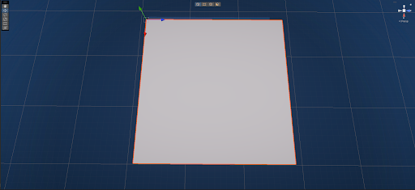

After we have added the terrain using the terrain tools, we can raise and lower it to create islands and mountains (a). We can also add texture using the **Paint Texture** tab of the terrain tools (b).

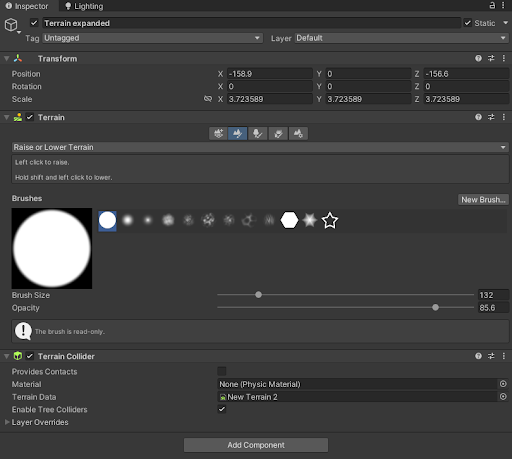
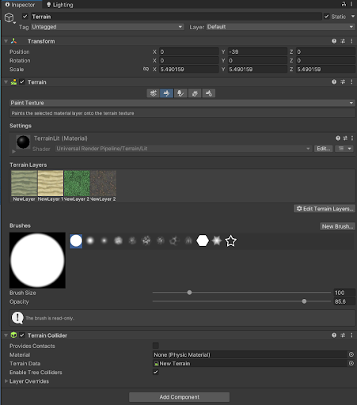

Now we can add a skybox to our map using the lighting option by going to **Window > Rendering > Lighting**. When we are in the Lighting tab, we click **Environment** and here we add our skybox material.

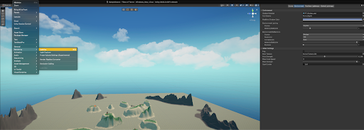

The next step is to add water to the map. We used an asset called **SimpleWaterShader**, grabbed the prefab, and placed it in the scene.

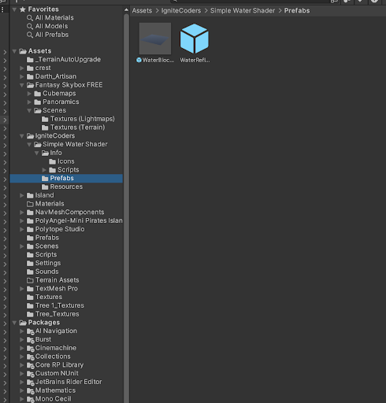
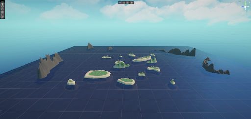

We also added props around the map to give it more life. We did this by downloading assets from the Unity Asset Store and dragging and dropping them into the map.

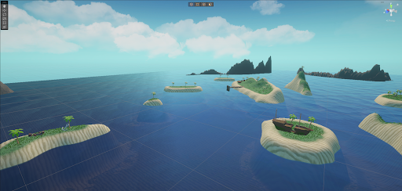

We then created invisible walls around the map to prevent players from falling out of the map. To do this, we first created an **Empty Object**, named it **Invisible Walls**, and added plains. We removed the Mesh Renderer to create the invisible walls.

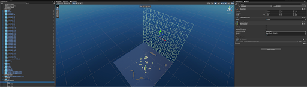

We then repeated this process with three more walls.

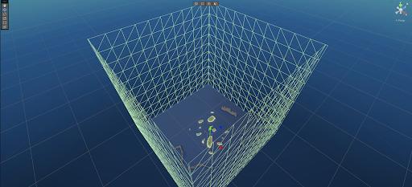

After adding the water, we added a cube to the scene to code the floating. We attached a **Rigidbody** to the cube with a small amount of drag and created the **Buoyancy Script**, then added it to the cube.

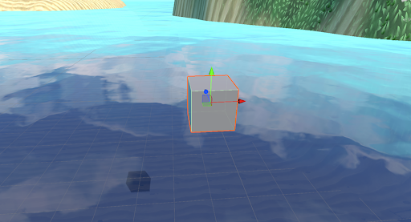

We then added a larger cube and placed 4 floating points on each corner to simulate better buoyancy for a larger object.

We tested it to see how it reacted to a small block on top of the large cube, then added mass to the cube on top to observe if it stayed afloat after being struck by a heavy object.

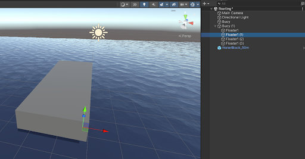

We created a large cube to simulate the body and added the mesh of the **Boat Prefab** from assets.

We simulated the body using a block, as using the boat's geometry directly caused physics glitches due to the lack of symmetry. We then created both the **Player** and **Enemy Prefabs**.

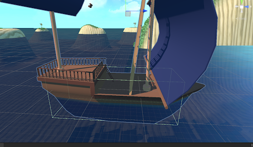

We then created a script for **Boat Movement**, aiming to make the movement as realistic as possible. We added features to control speed, acceleration, turn speed, and drag.

Next, we created a **CannonController Script** to add aiming, shooting, and effects to the cannons. We created a **CannonBall Prefab** to shoot and a **Smoke Prefab** for the shooting effect. We then added an **Explosion Effect** for when the cannonball made contact with something.

Here we used the **Cinemachine Package** from Unity to add a third-person view of the player's boat.

We then added a feature so that when the boat reaches a life value of 0, it starts to slowly sink. After a few seconds, it disappears and drops a barrel that floats up.

The barrel is designed so that when a player or enemy with less than maximum life goes over it, they pick it up, and it restores life to them, creating a **Healing System** in the game.

## AI Creation

Now let's move on to creating AI.

We created a **GameObject** in the enemy prefab with the code for the AI, which includes the **EnemyFSM** and **Sight Script** to give the AI its intelligence.

Here is the AI in 2 of its four stages: **Chasing Player** and **Rotating to Attack Player**.

When the player is not near the AI, the AI is designed to **Wander Around**. The last stage is a **Death Stage** to prevent the AI from shooting during the death animation.

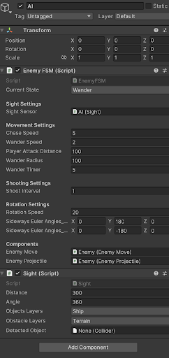

We then added **Post Processing** to the **GlobalVolume Asset** to make the game look more stylized. Additionally, we added fog in **Window > Rendering > Lighting > Environment Tab** to simulate fog in the distance.

